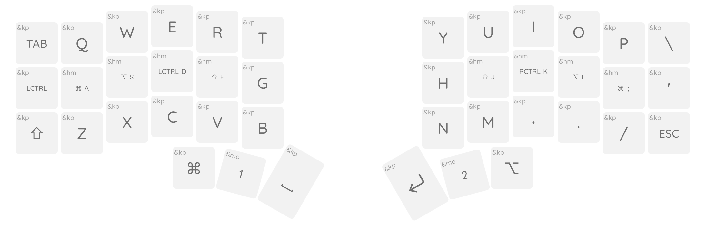

# Keymap Editor Demo: Corne

This is a customization of the ZMK config for the Corne keyboard with machine
readable layout and keymap definitions for use with my [keymap-editor] tool.

> **Note**
> If you aren't here to see how you can use my [keymap-editor] you would be
> better off not forking this repository.
>
> It's not that you _can't_ or are not welcome to, but as I made this is for
> demonstration purposes I've never actually tested it on a corne keyboard.
> You're just better off using the one that is provided in the ZMK repo.

> **Warning**
> In fact, this demo includes rotary encoders which don't exist for the corne
> keyboard, so while the produced keymap is syntactically valid it can't be
> used as-is to build ZMK firmware for an actual corne.

## What's included

This repo provides a basic corne 6x3 keymap ([`config/corne.keymap`]) that
demonstrates some key features of the keymap editor, and a metadata file
([`config/corne.json`]) to describe the layout and other features of a corne
keyboard in a way that the keymap editor can use.

## How should I use this

- Read through the keymap and layout files here.
- Generate your own from this [template], and link your repo to the keymap editor app.
- Use [keymap-layout-tools] to preview changes to a layout definition to apply to other keyboards.

[keymap-editor]:https://github.com/nickcoutsos/keymap-editor
[keymap-layout-tools]:https://nickcoutsos.github.io/keymap-layout-tools/
[`config/corne.keymap`]:config/corne.keymap
[`config/corne.json`]:config/corne.json
[template]:https://github.com/nickcoutsos/keymap-editor-demo-crkbd/generate